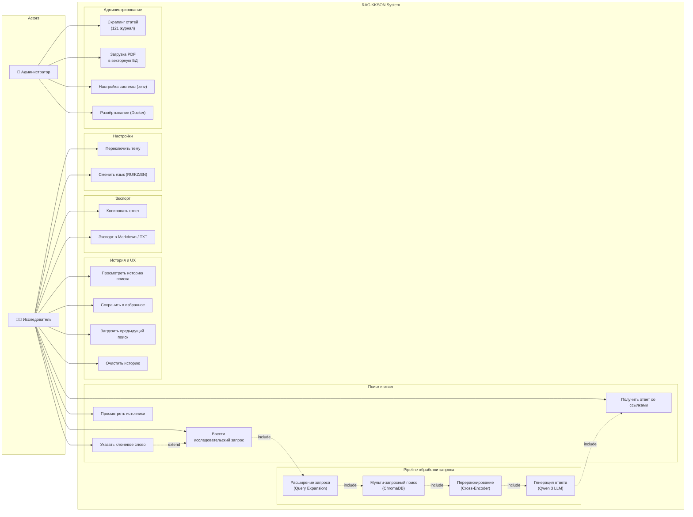

# UML Use Case Diagram — RAG KKSON

## Диаграмма



## Описание акторов

| Актор | Описание |
|-------|----------|
| **Исследователь** | Основной пользователь системы. Задаёт вопросы на RU/KZ/EN, получает ответы со ссылками на источники |
| **Администратор** | Управляет сбором данных, загрузкой в БД и развёртыванием системы |

## Описание прецедентов

### Поиск и ответ (основной сценарий)

| # | Прецедент | Описание | Тип |
|---|-----------|----------|-----|
| UC1 | Ввести исследовательский запрос | Пользователь вводит вопрос в поисковую строку | Основной |
| UC2 | Указать ключевое слово | Опциональный фильтр — слово должно присутствовать в найденных фрагментах | Extend UC1 |
| UC3 | Получить ответ со ссылками | Система отображает стримингом ответ с цитатами [Источник, стр. N] | Основной |
| UC4 | Просмотреть источники | Карточки источников: название файла, страница, скор релевантности, превью текста | Основной |

### Pipeline обработки (внутренние прецеденты)

| # | Прецедент | Описание | Тип |
|---|-----------|----------|-----|
| UC5 | Расширение запроса | LLM генерирует 3 подзапроса для покрытия разных аспектов темы | Include |
| UC6 | Мульти-запросный поиск | 4 запроса ищутся параллельно в ChromaDB, результаты объединяются | Include |
| UC7 | Переранжирование | Cross-encoder оценивает релевантность каждого (запрос, фрагмент) | Include |
| UC8 | Генерация ответа | Qwen 3 формирует структурированный ответ по top-10 фрагментам | Include |

### История и UX

| # | Прецедент | Описание |
|---|-----------|----------|
| UC9 | Просмотреть историю | Список предыдущих запросов в боковой панели |
| UC10 | Сохранить в избранное | Закладка на конкретный поиск |
| UC11 | Загрузить предыдущий поиск | Повторное отображение сохранённого ответа и источников |
| UC12 | Очистить историю | Удаление всех записей из localStorage |
| UC13 | Копировать ответ | Копирование текста ответа в буфер обмена |
| UC14 | Экспорт | Скачивание ответа в формате Markdown или TXT |
| UC15 | Переключить тему | Светлая / тёмная тема интерфейса |
| UC16 | Сменить язык | Переключение UI между русским, казахским и английским |

### Администрирование

| # | Прецедент | Описание |
|---|-----------|----------|
| UC17 | Скрапинг статей | Автоматический сбор PDF из 121 журнала (OJS, CyberLeninka, кастомные) |
| UC18 | Загрузка в БД | Парсинг PDF → чанкинг → эмбеддинги → ChromaDB |
| UC19 | Настройка системы | Конфигурация через .env (API ключи, модели, пороги) |
| UC20 | Развёртывание | Docker-compose деплой на VPS |

## Основной сценарий (Main Success Scenario)

```
1. Исследователь вводит запрос: "гражданское право Казахстана"
2. [include] Система расширяет запрос в 4 подзапроса (Query Expansion)
3. [include] Мульти-запросный поиск находит ~22 уникальных фрагмента
4. [include] Cross-encoder переранжирует и отбирает top-10
5. [include] Qwen 3 генерирует структурированный ответ стримингом
6. Исследователь видит ответ со ссылками на источники
7. Исследователь может просмотреть карточки источников
8. Запрос автоматически сохраняется в историю
```
